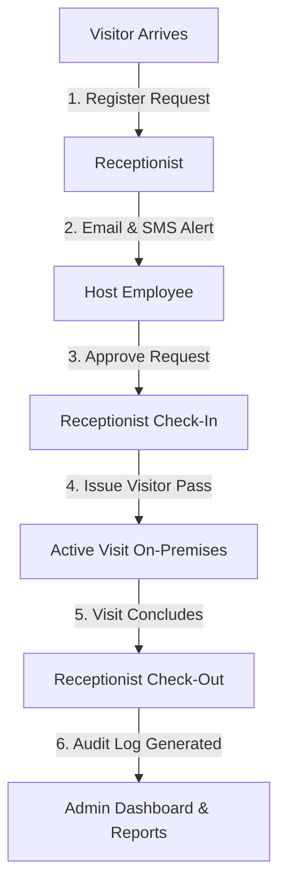

# 🏢 Visitor Pass Management System (MERN Stack)

A secure, enterprise-grade Visitor Pass Management System built using **MongoDB, Express.js, React.js, and Node.js (MERN)**. Designed for organizations to streamline visitor registration, host employee approvals, real-time check-in/check-out tracking, audit logging, and reporting.

---

## 🌐 Live Application & Repositories

- **Live Frontend (Vercel):** [https://visitor-pass-management-ten.vercel.app](https://visitor-pass-management-ten.vercel.app)
- **Live Backend API (Render):** [https://visitor-pass-management-h7x6.onrender.com](https://visitor-pass-management-h7x6.onrender.com)
- **GitHub Repository:** [https://github.com/sheshathrik/Visitor-Pass-Management-](https://github.com/sheshathrik/Visitor-Pass-Management-)

---

## 🔑 Demo Login Credentials

| Role | Email Address | Password | Permissions & Scope |
| :--- | :--- | :--- | :--- |
| **Administrator** | `admin@visitorpass.com` | `Admin@123` | Full administrative control, employee management, user accounts, visitor reports, Excel/PDF exports, system audit trail. |
| **Receptionist** | `receptionist@visitorpass.com` *(or sign up)* | *(As configured)* | Visitor registration, check-in, check-out, and visitor history. |
| **Employee** | *(Linked employee email)* | *(As configured)* | Review, approve, or reject assigned visitor requests with custom remarks (Single & Bulk actions). |

---

## 🛠️ Technology Stack

- **Frontend:** React 19, Vite, React Router v7, Recharts (Data Visualizations), Axios.
- **Backend:** Node.js, Express.js (v5), Mongoose (v9), JSON Web Tokens (JWT), Bcrypt.js.
- **Database:** MongoDB Atlas (Cloud Database with optimized compound indexes).
- **Document Export:** ExcelJS (.xlsx workbooks) & PDFKit (A4 landscape PDF generation).
- **Communication & Alerts:** Nodemailer (HTML Email Notifications) & Fast2SMS API (Indian Mobile Number SMS dispatch).

---

## 👥 User Roles & Permissions



### 1. 🛡️ Administrator
- **Dashboard:** High-level metrics, 7-day visitor traffic bar chart, today's status breakdown pie chart.
- **Employee Management:** Add new employees, update employee details, deactivate active employee records.
- **User Accounts:** Provision system logins for Administrators, Receptionists, and Employees (with employee profile linkage), toggle account active status.
- **Visitor Reports:** Filter reports by Today, This Week, or Custom Date Range; interactive status filtering; single and bulk record export to **Excel (.xlsx)** and **PDF**.
- **Activity History:** Full chronological audit log of all system actions.

### 2. 📋 Receptionist
- **Visitor Registration:** Register visitors with photo ID proof, purpose, host employee selection, date, and arrival time.
- **Check-In:** Admit approved visitors upon arrival on or after scheduled visit date.
- **Check-Out:** Record visitor departure and enforce valid check-out timestamping.
- **Visitor History:** Comprehensive searchable visitor records with status and date filters.

### 3. 👤 Employee (Host)
- **Visitor Requests Queue:** View all pending visitor requests awaiting host review.
- **Decision Workflow:** Approve or reject individual requests with host remarks.
- **Bulk Operations:** Select multiple pending requests to approve or reject in one click.
- **Approval History:** Personal activity log tracking actions taken on assigned visitors.

---

## ⚖️ Enforced Business Rules

The backend strictly validates and enforces all 10 core business rules:

1. **Rule 1 (Single Active Visit):** A visitor cannot have more than one active visit (`approved` or `checked_in`) concurrently.
2. **Rule 2 (No Same-Day Duplicate):** A visitor cannot register multiple times for the same date unless previously cancelled.
3. **Rule 3 (No Past Visit Dates):** Visit dates cannot be earlier than the current date.
4. **Rule 4 (No Past Arrival Time Today):** For same-day registrations, expected arrival time must be later than the current time.
5. **Rule 5 (Pending Request Limit):** An employee cannot have more than 3 pending visitor requests awaiting approval.
6. **Rule 6 (Approval Precondition):** Visitors can only be checked in after host employee approval.
7. **Rule 7 (No Re-check-in):** A visitor who is currently checked in cannot be checked in again before checking out.
8. **Rule 8 (Sequential Timestamps):** Check-out time must always be later than check-in time.
9. **Rule 9 (Rejection Barrier):** Rejected visitor requests can never be checked in.
10. **Rule 10 (Active List Isolation):** Cancelled visits are automatically excluded from active visitor queues.

---

## 🚀 Local Development & Setup

### Prerequisites
- Node.js (v18 or higher)
- npm (v9 or higher)
- MongoDB instance (local or MongoDB Atlas connection URI)

### 1. Clone Repository
```bash
git clone https://github.com/sheshathrik/Visitor-Pass-Management-.git
cd Visitor-Pass-Management-
```

### 2. Backend Setup
```bash
cd backend
npm install
```

Create a `.env` file in `/backend` using the provided template:
```env
PORT=5001
MONGO_URI=mongodb://127.0.0.1:27017/visitor-pass-management
JWT_SECRET=your_jwt_secret_key_here
NODE_ENV=development
CORS_ORIGINS=http://localhost:5173,http://127.0.0.1:5173

# Admin Bootstrap (Run once on initial startup)
BOOTSTRAP_ADMIN_NAME=System Administrator
BOOTSTRAP_ADMIN_EMAIL=admin@visitorpass.com
BOOTSTRAP_ADMIN_PASSWORD=Admin@123

# Email Notifications (Optional - Nodemailer)
SMTP_HOST=smtp.gmail.com
SMTP_PORT=587
SMTP_USER=your_email@gmail.com
SMTP_PASS=your_app_password
EMAIL_FROM=Visitor Pass <your_email@gmail.com>

# SMS Notifications (Optional - Fast2SMS Quick SMS Route)
FAST2SMS_API_KEY=your_fast2sms_api_key_here
```

Start backend development server:
```bash
npm run dev
# or for production start:
npm start
```

### 3. Frontend Setup
```bash
cd ../frontend
npm install
```

Create a `.env` file in `/frontend`:
```env
VITE_API_URL=http://localhost:5001/api
```

Start frontend Vite dev server:
```bash
npm run dev
```
Open [http://localhost:5173](http://localhost:5173) in your browser.

---

## 📡 REST API Documentation

### Authentication (`/api/auth`)
| Method | Endpoint | Access | Description |
| :--- | :--- | :--- | :--- |
| `POST` | `/api/auth/login` | Public | Authenticates user with email & password, returns JWT token. |
| `POST` | `/api/auth/register` | Public/Config | Self-registration for employee or receptionist accounts. |
| `GET` | `/api/auth/me` | Authenticated | Retrieves profile of currently authenticated user. |

### Employee Management (`/api/employees`)
| Method | Endpoint | Access | Description |
| :--- | :--- | :--- | :--- |
| `GET` | `/api/employees` | Admin, Receptionist | Lists all active employees for selection. |
| `POST` | `/api/employees` | Admin | Creates a new employee record. |
| `PATCH` | `/api/employees/:id` | Admin | Updates employee details. |
| `DELETE` | `/api/employees/:id` | Admin | Soft-deactivates an employee. |

### User Accounts (`/api/users`)
| Method | Endpoint | Access | Description |
| :--- | :--- | :--- | :--- |
| `GET` | `/api/users` | Admin | Lists all user accounts with linked employee details. |
| `POST` | `/api/users` | Admin | Provisions a new user account (Admin/Receptionist/Employee). |
| `PATCH` | `/api/users/:id/status` | Admin | Activates or deactivates a user login account. |

### Visits & Passes (`/api/visits`)
| Method | Endpoint | Access | Description |
| :--- | :--- | :--- | :--- |
| `POST` | `/api/visits` | Receptionist | Registers a new visitor request (validates Rules 1–5). |
| `GET` | `/api/visits` | Authenticated | Fetches visitor history with search and filtering params. |
| `GET` | `/api/visits/pending` | Employee | Lists pending visitor requests assigned to logged-in host. |
| `GET` | `/api/visits/active/currently-inside` | Admin, Receptionist | Returns list of visitors currently checked in. |
| `PATCH` | `/api/visits/:id/approve` | Employee | Approves single visitor request. |
| `PATCH` | `/api/visits/:id/reject` | Employee | Rejects single visitor request. |
| `PATCH` | `/api/visits/bulk/approve` | Employee | Bulk approves selected pending requests. |
| `PATCH` | `/api/visits/bulk/reject` | Employee | Bulk rejects selected pending requests. |
| `PATCH` | `/api/visits/:id/check-in` | Receptionist | Checks in approved visitor on scheduled date (Rules 6–9). |
| `PATCH` | `/api/visits/:id/check-out` | Receptionist | Checks out visitor with timestamp validation (Rule 8). |
| `PATCH` | `/api/visits/:id/cancel` | Receptionist | Cancels pending/approved request (Rule 10). |
| `GET` | `/api/visits/:id/activity` | Authenticated | Activity log for a specific visitor pass. |
| `GET` | `/api/visits/bulk/export` | Admin | Exports selected visits to Excel or PDF. |

### Reports & Analytics (`/api/reports`)
| Method | Endpoint | Access | Description |
| :--- | :--- | :--- | :--- |
| `GET` | `/api/reports/summary` | Admin | Aggregated statistics for Today, Week, or Custom range. |
| `GET` | `/api/reports/trend` | Admin | Last 7 days visitor traffic data for Recharts visualization. |
| `GET` | `/api/reports/export/excel` | Admin | Generates `.xlsx` spreadsheet download. |
| `GET` | `/api/reports/export/pdf` | Admin | Generates formatted landscape `.pdf` document download. |

### Activity Audit Log (`/api/activities`)
| Method | Endpoint | Access | Description |
| :--- | :--- | :--- | :--- |
| `GET` | `/api/activities` | Admin, Employee | Retrieves chronological system activity audit trail. |

---

## 📄 License
This project was developed for the Jayam Web Solutions Technical Assessment.
